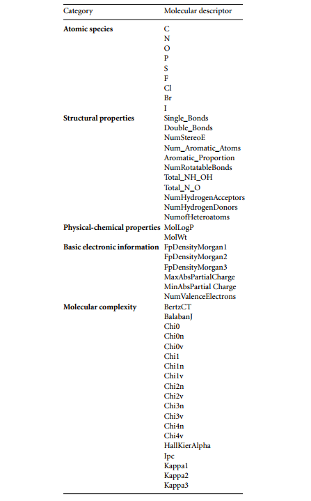

In this section, I demonstrate a piece of code that uses RDKit [^1] toolkit to extract molecular descriptors from known active molecules (ligands) targeting a specific protein. These descriptors are then used to train a machine learning model (e.g., support vector machine) to predict the binding activity of a ligand. 

The descriptors used in this code are taken from the published paper: [^2] `Quantum machine learning framework for virtual screening in drug discovery: a prospective quantum advantage` and the dataset used here is  LIT-PCBA dataset[^3], which is specifically designed for virtual screening and machine learning.


## Descriptors introduction

The chosen molecular descriptors(features) are generally classified into 5 classes:   


1. **Atomic species**: number and kind of atoms composing a molecule.   

2. **Structural properties**: number of single and double bonds, presence of aromatic rings, etc.  

3. **Physical-chemical properties**: molecular weight and lipophilicity  

4. **Basic electronic information**: general reactivity, polarity and rough electron density.  

5. **Molecular complexity**: the complexity of every atom environment in a molecule which depends on the molecular structure.   


The specific descriptors are presented as follow (from paper[^2] in appendix B): 

<div align=center>

</div>


## Code Demo

In the dataset, both active and inactive molecules are given in SMILES format. Here we only take the active ones (active.smi) as example: 

```python
# import packages
import pandas as pd
from rdkit import Chem
from rdkit.Chem import Mol
from rdkit.Chem import Descriptors
from rdkit.Chem.rdchem import BondType, BondStereo
from rdkit.ML.Descriptors import MoleculeDescriptors

# load 7167 molecules from SMILES file
suppl = Chem.SmilesMolSupplier('actives.smi')
# molecule counts
print(len(suppl))
```


```
7167
```


For practical purposes, the descriptors are not categorized into five classes but are instead grouped for ease of reference. 

```python
# declare the descriptors keywords
ATOMIC_SPECIES = ['C','N','O','P','S','F','Cl','Br','I']
BOND_TYPES = [BondType.SINGLE, BondType.DOUBLE, BondStereo.STEREOE]
AROMATIC_PROP = ['num_aroma_atoms', 'AP']
OTHER_PROP = ['NumHAcceptors', 'NumHDonors','NumHeteroatoms','NumRotatableBonds','NHOHCount','NOCount','MolWt', 'MolLogP']
ELEC_INFO = ['FpDensityMorgan1','FpDensityMorgan2','FpDensityMorgan3','MaxAbsPartialCharge','MinAbsPartialCharge','NumValenceElectrons']
MOL_COMP = ['BalabanJ','BertzCT','Chi0','Chi0n','Chi0v','Chi1','Chi1n','Chi1v','Chi2n','Chi2v','Chi3n','Chi3v','Chi4n','Chi4v','HallKierAlpha','Ipc','Kappa1','Kappa2','Kappa3']

# Pre-initialize descriptor calculator 
other_calc = MoleculeDescriptors.MolecularDescriptorCalculator(OTHER_PROP)
elec_calc = MoleculeDescriptors.MolecularDescriptorCalculator(ELEC_INFO)
mc_calc = MoleculeDescriptors.MolecularDescriptorCalculator(MOL_COMP)
```


```python
dataset=[]
for mol in suppl:
    # atom features: 'C','N','O','P','S','F','Cl','Br','I'
    mol_atom = [atoms.GetSymbol() for atoms in mol.GetAtoms()]
    atom_count = [mol_atom.count(atom) for atom in ATOMIC_SPECIES]

    # bond features: single, double, stereo
    mol_bond = [bonds.GetBondType() for bonds in mol.GetBonds()]
    mol_stereo = [bond.GetStereo() for bond in mol.GetBonds()]
    mol_total = mol_bond + mol_stereo
    bond_count = [mol_total.count(bond) for bond in BOND_TYPES]
    
    # aromaticity feature: No. of aromatic atoms + aromatic proportion
    num_aroma_atoms = len(list(mol.GetAromaticAtoms()))
    AP = num_aroma_atoms / mol.GetNumHeavyAtoms()
    aromatic = [num_aroma_atoms, AP]

    # other properties
    other_property = list(other_calc.CalcDescriptors(mol))
    el_property = list(elec_calc.CalcDescriptors(mol))
    mc_property = list(mc_calc.CalcDescriptors(mol))

    # combine all the features
    features = (atom_count + bond_count + aromatic + other_property + el_property + mc_property)
    dataset.append(features)  # save the data in a 2d array

# create dataframe
column_name = (ATOMIC_SPECIES + ['single', 'double', 'stereoE'] + AROMATIC_PROP + OTHER_PROP + ELEC_INFO + MOL_COMP)
df_actives = pd.DataFrame(data=dataset,columns = column_name)
df_actives
```


<div>
<style scoped>
    .dataframe tbody tr th:only-of-type {
        vertical-align: middle;
    }

    .dataframe tbody tr th {
        vertical-align: top;
    }
    
    .dataframe thead th {
        text-align: right;
    }
</style>
<table border="1" class="dataframe">
  <thead>
    <tr style="text-align: right;">
      <th></th>
      <th>C</th>
      <th>N</th>
      <th>O</th>
      <th>P</th>
      <th>S</th>
      <th>F</th>
      <th>Cl</th>
      <th>Br</th>
      <th>I</th>
      <th>single</th>
      <th>...</th>
      <th>HallKierAlpha</th>
      <th>Ipc</th>
      <th>Kappa1</th>
      <th>Kappa2</th>
      <th>Kappa3</th>
    </tr>
  </thead>
  <tbody>
    <tr>
      <th>0</th>
      <td>17</td>
      <td>5</td>
      <td>2</td>
      <td>0</td>
      <td>1</td>
      <td>0</td>
      <td>0</td>
      <td>0</td>
      <td>0</td>
      <td>16</td>
      <td>...</td>
      <td>-1.93</td>
      <td>1.175242e+06</td>
      <td>16.533706</td>
      <td>7.530765</td>
      <td>3.546026</td>
    </tr>
    <tr>
      <th>1</th>
      <td>21</td>
      <td>3</td>
      <td>3</td>
      <td>0</td>
      <td>1</td>
      <td>0</td>
      <td>0</td>
      <td>0</td>
      <td>0</td>
      <td>7</td>
      <td>...</td>
      <td>-3.32</td>
      <td>4.534871e+06</td>
      <td>18.062438</td>
      <td>8.141321</td>
      <td>3.841228</td>
    </tr>
    <tr>
      <th>2</th>
      <td>24</td>
      <td>4</td>
      <td>3</td>
      <td>0</td>
      <td>1</td>
      <td>0</td>
      <td>0</td>
      <td>0</td>
      <td>0</td>
      <td>13</td>
      <td>...</td>
      <td>-3.39</td>
      <td>1.794330e+07</td>
      <td>21.827384</td>
      <td>8.625014</td>
      <td>4.750895</td>
    </tr>
    <tr>
      <th>3</th>
      <td>25</td>
      <td>6</td>
      <td>1</td>
      <td>0</td>
      <td>0</td>
      <td>0</td>
      <td>0</td>
      <td>0</td>
      <td>0</td>
      <td>14</td>
      <td>...</td>
      <td>-3.32</td>
      <td>4.101819e+07</td>
      <td>20.575350</td>
      <td>9.042240</td>
      <td>4.338801</td>
    </tr>
    <tr>
      <th>4</th>
      <td>16</td>
      <td>2</td>
      <td>3</td>
      <td>0</td>
      <td>0</td>
      <td>0</td>
      <td>1</td>
      <td>0</td>
      <td>0</td>
      <td>9</td>
      <td>...</td>
      <td>-2.79</td>
      <td>1.331666e+05</td>
      <td>14.160087</td>
      <td>5.537123</td>
      <td>2.313694</td>
    </tr>
    <tr>
      <th>...</th>
      <td>...</td>
      <td>...</td>
      <td>...</td>
      <td>...</td>
      <td>...</td>
      <td>...</td>
      <td>...</td>
      <td>...</td>
      <td>...</td>
      <td>...</td>
      <td>...</td>
      <td>...</td>
      <td>...</td>
      <td>...</td>
      <td>...</td>
      <td>...</td>
    </tr>
    <tr>
      <th>7162</th>
      <td>11</td>
      <td>5</td>
      <td>2</td>
      <td>0</td>
      <td>1</td>
      <td>0</td>
      <td>0</td>
      <td>1</td>
      <td>0</td>
      <td>8</td>
      <td>...</td>
      <td>-1.63</td>
      <td>3.969946e+04</td>
      <td>14.772349</td>
      <td>6.213661</td>
      <td>3.273688</td>
    </tr>
    <tr>
      <th>7163</th>
      <td>21</td>
      <td>0</td>
      <td>8</td>
      <td>0</td>
      <td>0</td>
      <td>0</td>
      <td>0</td>
      <td>0</td>
      <td>0</td>
      <td>18</td>
      <td>...</td>
      <td>-3.65</td>
      <td>2.084500e+06</td>
      <td>20.093761</td>
      <td>7.402287</td>
      <td>3.572501</td>
    </tr>
    <tr>
      <th>7164</th>
      <td>14</td>
      <td>0</td>
      <td>3</td>
      <td>0</td>
      <td>0</td>
      <td>0</td>
      <td>0</td>
      <td>0</td>
      <td>0</td>
      <td>11</td>
      <td>...</td>
      <td>-1.64</td>
      <td>4.165319e+03</td>
      <td>15.360000</td>
      <td>9.576366</td>
      <td>9.298416</td>
    </tr>
    <tr>
      <th>7165</th>
      <td>8</td>
      <td>2</td>
      <td>5</td>
      <td>0</td>
      <td>0</td>
      <td>0</td>
      <td>0</td>
      <td>0</td>
      <td>0</td>
      <td>7</td>
      <td>...</td>
      <td>-2.02</td>
      <td>1.862336e+03</td>
      <td>11.057042</td>
      <td>4.467681</td>
      <td>2.989007</td>
    </tr>
    <tr>
      <th>7166</th>
      <td>22</td>
      <td>1</td>
      <td>5</td>
      <td>0</td>
      <td>0</td>
      <td>0</td>
      <td>0</td>
      <td>0</td>
      <td>0</td>
      <td>14</td>
      <td>...</td>
      <td>-3.41</td>
      <td>2.506479e+06</td>
      <td>19.354312</td>
      <td>8.083712</td>
      <td>3.174880</td>
    </tr>
  </tbody>
</table>
<p>7167 rows × 47 columns</p>
</div>

```python
# add labels for actives and save files
df_actives['label']= 1  # pandas will broadcast the value to all lines
df_actives.to_csv('actives.csv', index=False) # save index or not, True by default
```

There are 7167 molecules and 47 descriptors(features) in total. Before input all data to train and test a Support Vector Machine, we need to first refine these features. Specifically, we will employ feature reduction and feature selection methods to reduce the dimension of features while retaining the most significant data patterns. The resulting dimensionality reduction decreases computational complexity, removes noise and redundancy, ultimately improving accuracy and generalization of ML model. In the next step, I will employ Principle Component Analysis(PCA) for feature reduction and Analysis of Variance(ANOVA) for feature selection using scikit learn library. 


## Reference

[^1]: RDKit: Open-source cheminformatics. https://www.rdkit.org.

[^2]: Mensa, S., Sahin, E., Tacchino, F., Kl Barkoutsos, P., & Tavernelli, I. (2023). Quantum machine learning framework for virtual screening in drug discovery: a prospective quantum advantage. *Machine Learning: Science and Technology*, *4*(1), 015023.
[^3]:Tran-Nguyen, V. K., Jacquemard, C., & Rognan, D. (2020). LIT-PCBA: an unbiased data set for machine learning and virtual screening. *Journal of chemical information and modeling*, *60*(9), 4263-4273.


