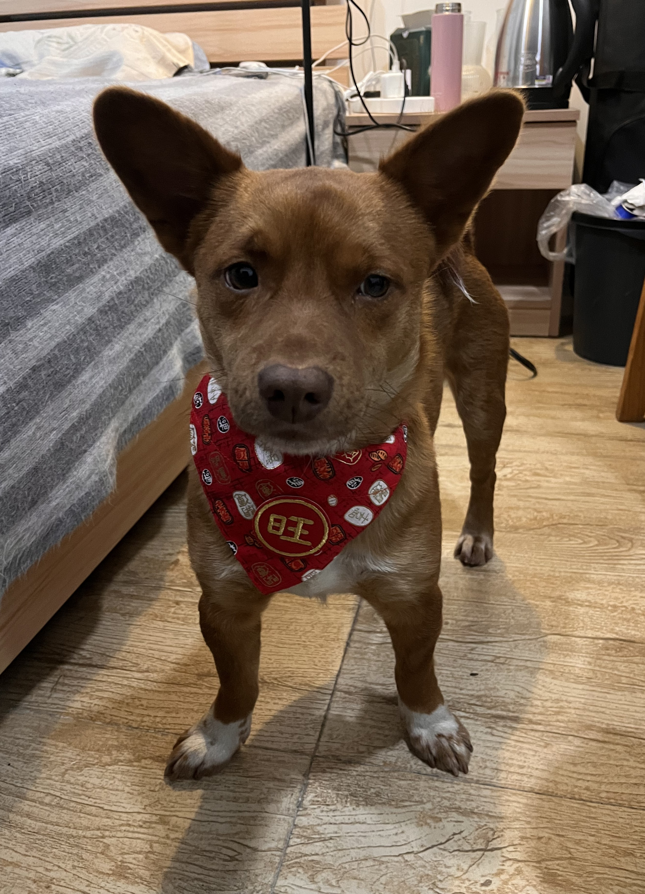

This is Jianyu's personal website. In this website I put some notes and code about quantum chemistry and quantum computing I'm interested in. (I used to put it in my personal blog in Chinese, now I've translated and organized them on Github pages.) This website is still under construction, I will keep it up to date as much as I can. 

My master study was about using computational chemistry method (DFT and MD) to describe and understand gelation behavior of bis-urea-based hydrogelators. After graduation, I joined in Origin Quantum company as a quantum algorithm developer, where my research interest is about optimization and application of variational quantum algorithms in solving real-world problems. 

---

In this website, I arranged my notes in four sections: 

The `Computational chemistry` section consists of two parts: First part is about Hartree-Fork(HF) Theory and Density Functional Theory(DFT) with some clumsy realization in python codes (no optimization on calculation performance at all, simply translate the self-consistent field into practical codes). Another part is about machine-learning (mainly SVM and random forests) and related practical codes in specific cases. I don’t have a strong background in machine learning comparing to my experience in quantum chemistry. So in this part, I'll focus less on building machine-learning models from scratch and more on using machine-learning as a tool to analyse data from my past projects.

In `Quantum Computing` section, I will introduce some quantum computing knowledge in quantum chemistry (computaional-chemists-friendly) and some secret weapon(questions) to destroy someone who claims "quantum computing superiority" on chemistry over conventional computational chemistry :)

In `Scripts` section, you’ll find a mix of experiments of molecule visualization and some (possibly) reusable code snippets of plotting and scripts.

At last, I post some of my reflections in `Blog` section, which includes quantum computing, computational chemistry and language learning, etc. Welcome to leave comments to my posts! 

FYI, this static site is built based on documentation framework [Material for Docs](https://squidfunk.github.io/mkdocs-material/). A quick tutorial can be checked on [james-willett's blog](https://jameswillett.dev/getting-started-with-material-for-mkdocs/#introduction). 

