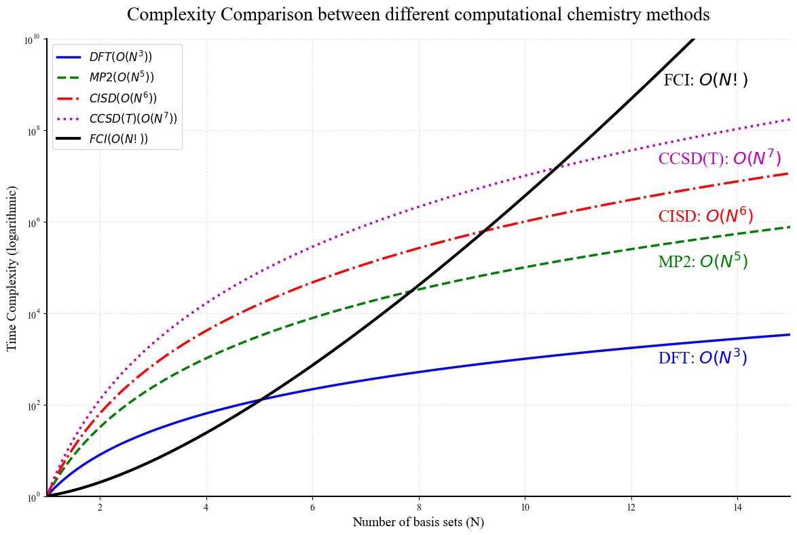

This is python script for drawing the time complexity of different computational chemistry method using package matplotlib.

```python
import numpy as np
# %matplotlib inline
import matplotlib.pyplot as plt
from scipy.special import factorial
# # # setting support for Chinese font
# plt.rcParams['font.sans-serif'] = ['SimHei', 'Arial Unicode MS', 'Microsoft YaHei', 'DejaVu Sans']  
# plt.rcParams['axes.unicode_minus'] = False  # solve minus sign display probelm
plt.rcParams['font.family'] = 'serif'
plt.rcParams['font.serif'] = ['Times New Roman']
```


```python
# define function for different complexity 
def dft_complexity(n):
    return n**3

def mp2_complexity(n):
    return n**5

def cisd_complexity(n):
    return n**6

def ccsd_t_complexity(n):
    return n**7

def fci_complexity(n):
    return factorial(n)
```


```python
# create datapoint 
n = np.linspace(1, 15, 100)  
dft_vals = dft_complexity(n)
mp2_vals = mp2_complexity(n)
cisd_vals = cisd_complexity(n)
ccsd_t_vals = ccsd_t_complexity(n)
fci_vals = fci_complexity(n)
```


```python
# plot the figure canvas
plt.figure(figsize=(12, 8), dpi=100)

# plot with logarithmic scaling on the y-axis
plt.semilogy(n, dft_vals, 'b-', linewidth=2.5, label=r'$DFT (O(N^3))$')
plt.semilogy(n, mp2_vals, 'g--', linewidth=2.5, label=r'$MP2 (O(N^5))$')
plt.semilogy(n, cisd_vals, 'r-.', linewidth=2.5, label=r'$CISD (O(N^6))$')
plt.semilogy(n, ccsd_t_vals, 'm:', linewidth=2.5, label=r'$CCSD(T) (O(N^7))$')
plt.semilogy(n, fci_vals, 'k-', linewidth=3, label=r'$FCI (O(N!))$')


# # add special mark point
# methods = [('DFT', 8, dft_complexity(8)), 
#            ('MP2', 6, mp2_complexity(6)),
#            ('CISD', 5, cisd_complexity(5)),
#            ('CCSD(T)', 4, ccsd_t_complexity(4)),
#            ('FCI', 5, fci_complexity(5))]

# for name, pos, val in methods:
#     plt.plot(pos, val, 'bo', markersize=8)
#     plt.annotate(name, 
#                 xy=(pos, val),
#                 xytext=(10, 15 if name != 'FCI' else -30),
#                 textcoords='offset points',
#                 arrowprops=dict(arrowstyle="->", color='red'),
#                 fontsize=12,
#                 weight='bold')

plt.title('Complexity Comparison between different computational chemistry methods', fontsize=20, pad=20)
plt.xlabel('Number of basis sets (N)', fontsize=14)
plt.ylabel('Time Complexity (logarithmic)', fontsize=14)
plt.grid(True, which="both", ls="--", alpha=0.3)
plt.legend(loc='upper left', fontsize=12)

# set axis range
plt.xlim(1, 15)
plt.ylim(1, 10**10)

# add complexity text
plt.text(12.6, 10**9, r'FCI: $O(N!)$', fontsize=18, color='k')
plt.text(12.5, 10**7.25, r'CCSD(T): $O(N^7)$', fontsize=18, color='m')
plt.text(12.5, 10**6, r'CISD: $O(N^6)$', fontsize=18, color='r')
plt.text(12.5, 10**5, r'MP2: $O(N^5)$', fontsize=18, color='g')
plt.text(12.5, 10**2.9, r'DFT: $O(N^3)$', fontsize=18, color='b')

# add frame line 
plt.gca().spines['top'].set_visible(False)
plt.gca().spines['right'].set_visible(False)
plt.gca().spines['left'].set_linewidth(1.5)
plt.gca().spines['bottom'].set_linewidth(1.5)

plt.tight_layout()
plt.show()
```


​    


